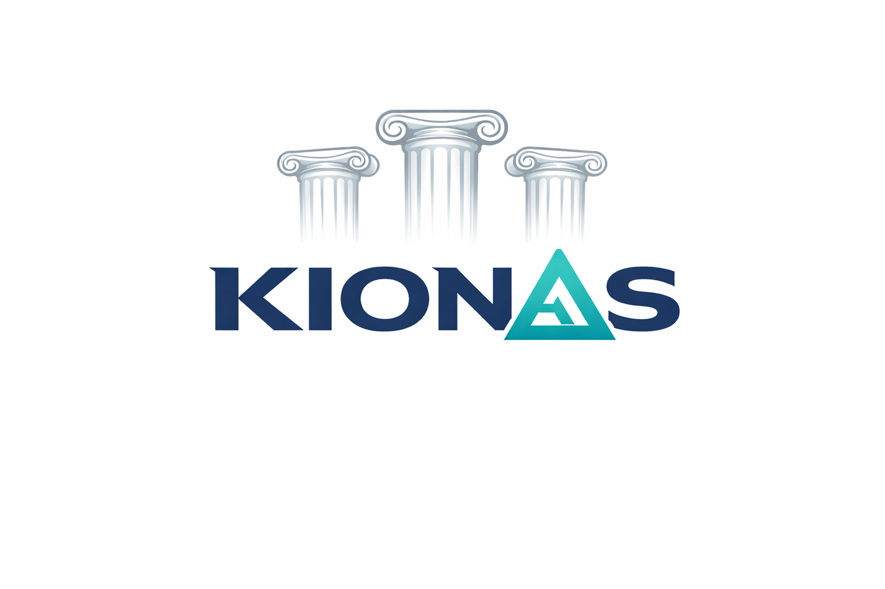

# Kionas

**TL;DR**
- Kionas is a Rust-native, modular data platform prototype (server, worker, metastore, client) focused on pluggable storage, gRPC interop, and coordinated transactions. It is early-stage and welcomes contributions.

**What Do We Have So Far**
- **Crates**: : workspace crates including [server](server), [worker](worker), [metastore](metastore), [client](client), and the shared `kionas` crate.
- **Staging**: : storage staging helpers and a staging manifest workflow.
- **Minio provider**: : S3/MinIO-compatible storage provider implementation.
- **Transactions**: : `transactions::maestro` for coordination of prepare/commit/abort flows.
- **Interops pool**: : pooled inter-service clients via `deadpool`.
- **gRPC / tonic**: : service definitions and servers generated/implemented with `tonic`.
- **TLS**: : `rustls`-based TLS integration and cert helper scripts.
- **Tests**: : unit and integration tests for core components (see `worker/tests`).

**Quickstart**
- **Prereqs**: Rust toolchain (rustup), Cargo, Docker (recommended for MinIO), optional: OpenSSL for cert helpers.
- Build the workspace: `cargo build --workspace`
- Run a service locally (examples):
  - `cargo run -p metastore`
  - `cargo run -p server`
  - `cargo run -p worker -- <worker_id>`
- Start compose stack: `docker compose -f docker/docker-compose.yaml up --build`

**Development**
- **Format**: : `cargo fmt --all`
- **Lint**: : `cargo clippy --all-targets --all-features -- -D warnings`
- **Build check**: : `cargo check`
- **Tests**: : `cargo test --workspace -- --test-threads=1`

**Configuration**
- Examples and runtime configs live in the `configs/` folder. Check each crate's `main.rs` for env vars and overrides.

**Contributing**
- See [CONTRIBUTING.md](CONTRIBUTING.md) for PR guidelines, code style, and testing expectations. We welcome issues, small PRs, and design discussions.

**Contact**
- Open an issue or PR on this repository for bugs, questions, or to propose changes.

---

Thanks for checking out Kionas — contributions and feedback are warmly welcome.
