# Stage Extraction & Routing Architecture

## Overview

Kionas transforms a centralized DataFusion logical plan into a distributed execution graph by:
1. **Identifying Exchange Points**: Where data must be shuffled between workers
2. **Extracting Stages**: Splitting the plan at Exchange operators
3. **Routing Each Stage**: Selecting target workers and partition strategy
4. **Building Output Destinations**: Constructing each stage's downstream routing map

This document explains the algorithm, design decisions, and implementation patterns.

---

## 1. Plan Decomposition: From Monolithic to Distributed

### 1.1 What is a Stage?

A **stage** is a contiguous subgraph of operators that executes on a single worker without data movement. When an Exchange operator appears in the plan, it marks a stage boundary.

**Example**: A query with a hash Join followed by an Aggregate:

```
                  ┌──────────────┐
                  │  Aggregate   │ ← Stage 2: Aggregate on partition streams
                  │  (GroupBy)   │
                  └──────┬───────┘
                         │
                  ┌──────▼────────┐
                  │   Exchange    │ ← Stage boundary
                  │  (Repartition)│   data shuffled between workers
                  └──────┬────────┘
                         │
            ┌────────────┴────────────┐
            │                         │
      ┌─────▼──────┐           ┌──────▼─────┐
      │   Join     │           │   Join     │
      │  (Hash)    │────────   │  (Hash)    │ ← Stage 1: Hash Join on each partition
      │            │           │            │
      └─────┬──────┘           └──────┬─────┘
            │                         │
      ┌─────▼──────┐           ┌──────▼─────┐
      │   Scan L   │           │   Scan R   │ ← Stage 0: Table Scans
      │ (table_a)  │           │ (table_b)  │
      └────────────┘           └────────────┘
```

**Stages extracted**:
- **Stage 0**: Scans (no Exchange below) → Each worker scans its partition
- **Stage 1**: Hash Join (Exchange below, Join above) → Hash-distributed join
- **Stage 2**: Aggregate (Exchange within group-by) → Repartition + Aggregate

### 1.2 Exchange Operator Placement Algorithm

Kionas places an Exchange operator when:

1. **A downstream operator needs globally distributed input** (Join, GroupBy, Window)
2. **Current workers' data partitioning doesn't match upstream requirement**

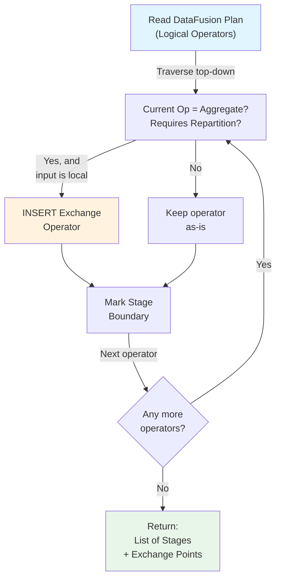

**Implementation**: [server/src/statement_handler/query/select.rs](../server/src/statement_handler/query/select.rs#L1600)

---

## 2. Partition Spec Inference: How is Data Distributed?

Once stages are extracted, each stage needs a **partition spec** that defines how data is divided among workers.

### 2.1 Partition Strategies

| Strategy | When Used | Example |
|---|---|---|
| **Single** | Stage 0 (initial scans) | Each worker scans its table partition |
| **Hash** | Join/GroupBy keys present | Partition by hash(join_key) across workers |
| **Range** | Sort-based operations or explicit range predicates | Partition by key range (1-100k, 100k-200k, ...) |
| **RoundRobin** | Broadcasting or load-balancing | Distribute rows sequentially (1→W1, 2→W2, 3→W3, ...) |

### 2.2 Selection Algorithm

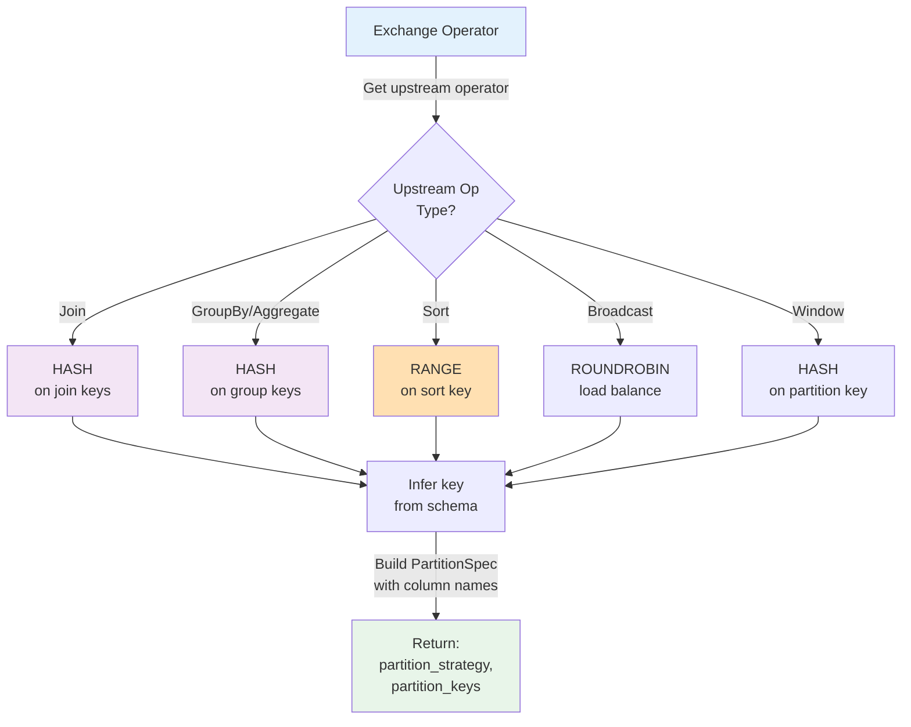

### 2.3 Example: Hash Join Query

```sql
SELECT A.id, B.val
FROM table_a A
JOIN table_b B ON A.id = B.id
GROUP BY A.id
```

**PartitionSpec inference**:

| Stage | Operator | Partition Strategy | Example Config |
|---|---|---|---|
| 0 | Table Scan | **Single** (each worker gets its primary partition) | `{strategy: "single"}` |
| 1 | Hash Join | **Hash on `id`** | `{strategy: "hash", keys: ["id"], bucket_count: 16}` |
| 2 | GroupBy | **Hash on `id`** | `{strategy: "hash", keys: ["id"], bucket_count: 16}` |

---

## 3. Downstream Worker Selection: How are Target Workers Chosen?

Once partition strategy is determined, Kionas selects which workers execute each partition.

### 3.1 Worker Discovery Sources

Workers can be discovered via:

1. **Consul** (primary if enabled)
   - Query: `GET /v1/catalog/service/worker`
   - Returns: Live worker list with health status
   - Refresh: Every minute or on dispatch

2. **Runtime Environment Variables** (fallback)
   - `KIONAS_WORKER_HOSTS=w1:50051,w2:50051,w3:50051`
   - Static list, always available

3. **Config File** (legacy)
   - `workers.json`: Static worker list
   - Used when Consul unavailable and env var not set

### 3.2 Worker Selection Strategy

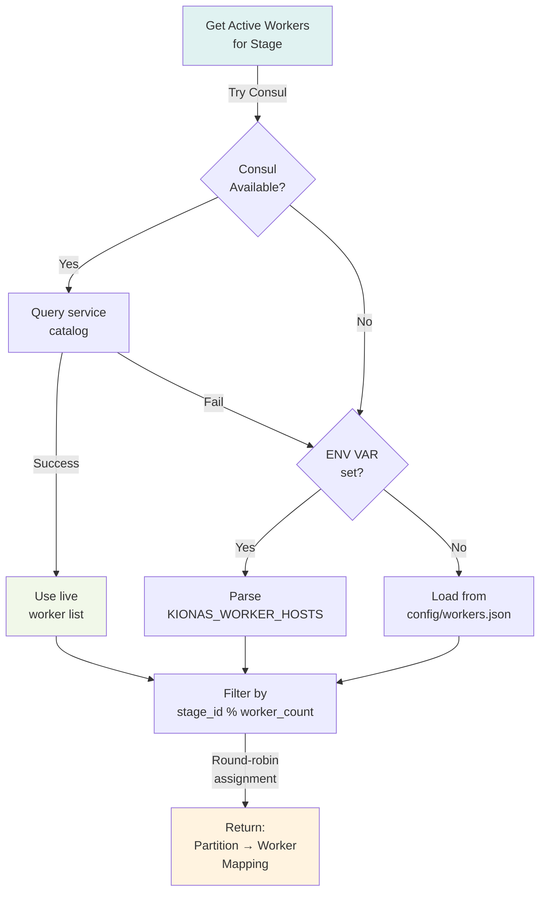

**Implementation**: [server/src/statement_handler/shared/worker_routing.rs](../server/src/statement_handler/shared/worker_routing.rs)

### 3.3 Example: Join Stage Worker Assignment

**Setup**:
- 4 workers: W1, W2, W3, W4
- Join stage: partition_count = 16 (hash buckets)
- strategy = "hash" on join_key

**Assignment**:
```
Partition 0  → W1 (0 % 4)
Partition 1  → W2 (1 % 4)
Partition 2  → W3 (2 % 4)
Partition 3  → W4 (3 % 4)
Partition 4  → W1 (4 % 4)
...
Partition 15 → W4 (15 % 4)
```

---

## 4. Output Destination Construction: Building Routing Tables

For each stage, Kionas builds a routing table that tells a worker where to send its output (and which partition keys go where).

### 4.1 Destination Structure

Each stage's output destinations are captured in a map:

```rust
// From: worker/src/execution/router.rs
pub struct OutputDestinationMap {
    /// Partition ID → (Worker Address, Landing Zone)
    pub partitions: HashMap<u32, DestinationEndpoint>,
    
    /// Partition filter: which local rows go to which partition
    pub partition_key_columns: Vec<String>,
    
    /// Strategy: "hash", "range", "roundrobin"
    pub partition_strategy: String,
}
```

### 4.2 Destination Calculation Flow

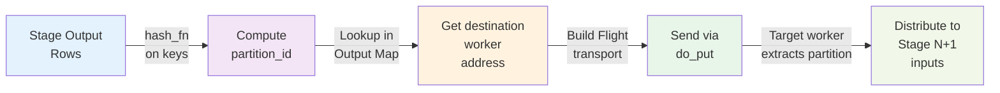

### 4.3 Example: Aggregate Stage with 3 Workers

**Query**: `SELECT col, SUM(val) FROM table GROUP BY col`

**Stage 1 (Hash Join)** outputs 16 partitions
**Stage 2 (Aggregate)** receives 16 stream-pairs, repartitions on `col`:

```
┌─────────────────────────────────────────┐
│ Stage 1 Output (Hash Join results)      │
│ Partitions 0–15 from 3 workers          │
└─────────────────────────────────────────┘
              ↓
┌─────────────────────────────────────────┐
│ Aggregate Output Destination Map         │
│ {                                        │
│   partition_strategy: "hash",           │
│   partition_key_columns: ["col"],       │
│   partitions: {                         │
│     0: {worker: "W1:50052", zone: "1"}, │
│     1: {worker: "W2:50052", zone: "1"}, │
│     2: {worker: "W3:50052", zone: "1"}, │
│     3: {worker: "W1:50052", zone: "2"}, │
│     ...                                 │
│   }                                      │
│ }                                        │
└─────────────────────────────────────────┘
              ↓
         For each row:
    hash(col) % 16 → partition_id
    destinations[partition_id] → worker address
         ↓
    Network send via Flight
```

**Implementation**: [worker/src/execution/router.rs#L277](../worker/src/execution/router.rs#L277)

---

## 5. Stage Extraction in Action: Complete Example

### 5.1 Query: Complex Join + Aggregate

```sql
SELECT 
  orders.customer_id,
  COUNT(*) as order_count,
  SUM(orders.total) as revenue
FROM orders
JOIN customers ON orders.customer_id = customers.id
WHERE orders.year = 2026
GROUP BY orders.customer_id
ORDER BY revenue DESC
LIMIT 10
```

### 5.2 Logical Plan (DataFusion)

```
Limit (10)
  └─ Sort (revenue DESC)
     └─ Aggregate (COUNT, SUM GROUP BY customer_id)
        └─ Join (INNER, orders.customer_id = customers.id)
           ├─ Filter (year = 2026)
           │  └─ TableScan (orders)
           └─ TableScan (customers)
```

### 5.3 Stage Extraction Process

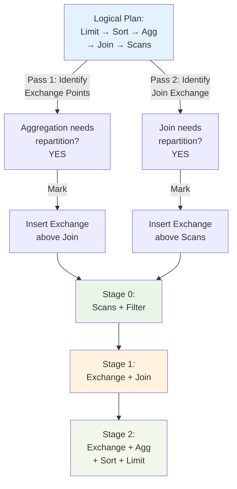

### 5.4 Extracted Stages

| Stage | Operators | Input | Partition Strategy | Output |
|---|---|---|---|---|
| **0** | Filter, TableScan | None (initial) | **Single** (each worker's local data) | Filtered rows |
| **1** | Exchange, Join | Stage 0 output | **Hash on `customer_id`** | Joined rows, partitioned by customer_id |
| **2** | Exchange, Aggregate, Sort, Limit | Stage 1 output | **Hash on `customer_id`** | Aggregated results, sorted, limited |

### 5.5 Execution Flow

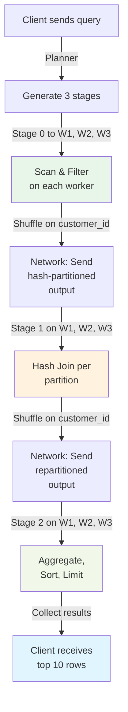

---

## 6. Pipeline Integration: Where Router Fits

The router module integrates into worker execution as follows:

### 6.1 Worker Execution Pipeline

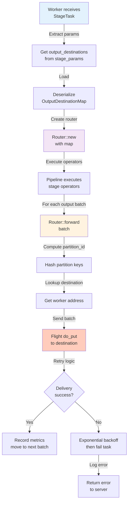

### 6.2 Code Path: [worker/src/execution/pipeline.rs](../worker/src/execution/pipeline.rs)

```rust
// Simplified flow:
pub async fn execute_query_task(task: StageTask) -> Result<QueryOutput> {
    // 1. Extract output destinations from stage params
    let destinations = task.stage_params.get("output_destinations_json")
        .and_then(|s| serde_json::from_str(s))?;
    
    // 2. Create router
    let router = OutputRouter::new(destinations)?;
    
    // 3. Execute stage operators
    let output = execute_stage_operators(&task, &router).await?;
    
    // 4. Router sends output batches to downstream stages
    // (called internally by execute_stage_operators)
    
    Ok(output)
}
```

**Key integration points**:
- Line ~1200: Router initialization
- Line ~1350: Batch forwarding in operator loop
- Line ~1450: Telemetry collection (network bytes, partition counts)

---

## 7. Detailed Example: Simple Scan+Project

### 7.1 Query

```sql
SELECT id, name FROM users WHERE age > 18
```

### 7.2 Plan Extraction

```
Original Plan:
  Projection (id, name)
    └─ Filter (age > 18)
       └─ TableScan (users)

No Exchange needed (no shuffle required)

Result: ONE STAGE (Stage 0)
  Operators: Filter + Projection
  Partition: Single (each worker processes its partition independently)
  Output destinations: None (results sent to client)
```

### 7.3 Execution

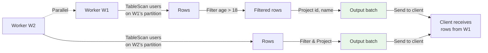

---

## 8. Medium Example: Scan+Filter+Aggregate

### 8.1 Query

```sql
SELECT department, AVG(salary)
FROM employees
WHERE hire_date > '2020-01-01'
GROUP BY department
```

### 8.2 Plan Extraction

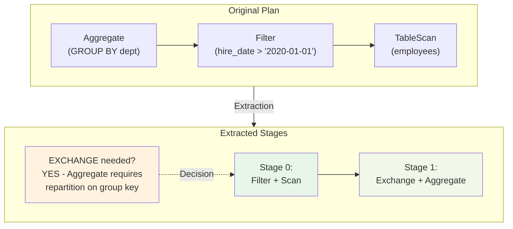

### 8.3 Execution with 2 Workers

```
W1: Scan employees partition 1 → Filter → 1500 rows
                                    ↓
                            ┌───────┴─────────┐
                            │                 │
              Hash("SALES") % 2 = 0      Hash("ENG") % 2 = 1
                            │                 │
W1: Stage 1 Agg         ← (SALES rows)   (ENG rows) → W2: Stage 1 Agg
     AVG(salary) by dept    ↓                 ↓
                            W1            ← network shuffle →    W2
                         [SALES: 2]                         [ENG: 1.5]
                            ↓                                  ↓
                         Send to client (or next stage)

Result: 2 output rows
  - SALES, avg_salary=80k
  - ENG, avg_salary=95k
```

---

## 9. Complex Example: Distributed Join + Aggregate

### 9.1 Query

```sql
SELECT 
  customers.region,
  COUNT(DISTINCT orders.id) as order_count
FROM customers
LEFT JOIN orders ON customers.id = orders.customer_id
GROUP BY customers.region
```

### 9.2 Plan Extraction

```
TableScan(customers) ─┐
                      ├─ Exchange (hash on customer_id)
TableScan(orders)    ─┤
                      └─ Join (LEFT)
                         │
                         ├─ Exchange (hash on region)
                         │
                         └─ Aggregate (GROUP BY region)
```

### 9.3 Stage Breakdown

| Stage | Operators | Partitions | Strategy |
|---|---|---|---|
| **0** | TableScan(customers), TableScan(orders) | Data-local | single |
| **1** | Exchange, Join | 8 | hash on `customer_id` |
| **2** | Exchange, Aggregate | 4 | hash on `region` |

### 9.4 Execution Flow with 3 Workers

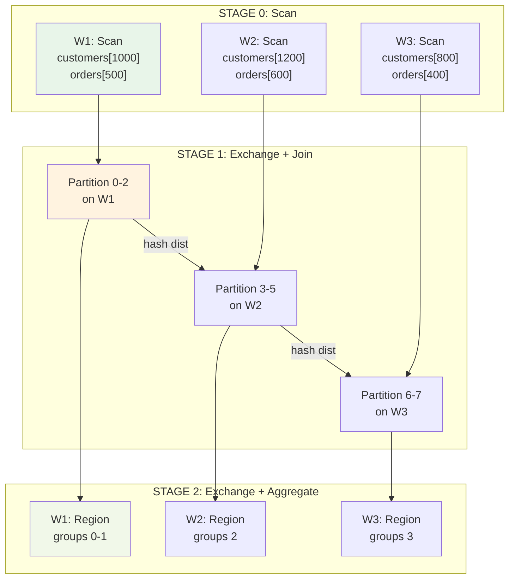

---

## 10. Partition Spec Inference Details

### 10.1 Hash Partition Inference

When an Exchange operator feeds a hash-based operation (Join, GroupBy):

```rust
// From: server/src/statement_handler/query/select.rs
fn infer_partition_spec(upstream_op: &LogicalPlan) -> PartitionSpec {
    match upstream_op {
        LogicalPlan::Join { on, .. } => {
            // Extract join keys
            let keys: Vec<String> = on.iter()
                .map(|(left, right)| format_key(left, right))
                .collect();
            PartitionSpec::Hash {
                keys,
                bucket_count: determine_bucket_count(),  // e.g., 16
            }
        }
        LogicalPlan::Aggregate { group_by, .. } => {
            // Hash on GROUP BY keys
            let keys = group_by.iter()
                .map(|e| expr_to_string(e))
                .collect();
            PartitionSpec::Hash { keys, bucket_count }
        }
        // ... other cases
    }
}
```

### 10.2 Bucket Count Selection

Bucket count is chosen based on:
- Upstream partition count
- Available worker count
- Data volume estimate

```
bucket_count = max(
    upstream_partition_count,
    worker_count * parallelism_factor  // default: 4
)
```

**Example**:
- 3 workers, 12 rows of data (small)
- bucket_count = max(1, 3 * 4) = **12**
- Each worker gets 4 "virtual" partitions to maximize parallelism

---

## 11. Worker Routing Deep-Dive

### 11.1 Consul Integration

If Consul is configured:

```
1. Server startup:
   POST /v1/agent/service/register {
       Name: "worker",
       ID: "w1",
       Address: "worker1.local",
       Port: 50051,
       Check: { HTTP: "...", Interval: "10s" }
   }

2. Stage dispatch (planner):
   GET /v1/catalog/service/worker
   → Returns: [
       {ServiceID: "w1", Address: "worker1.local", Port: 50051, Status: "passing"},
       {ServiceID: "w2", Address: "worker2.local", Port: 50051, Status: "passing"},
       ...
   ]

3. Select subset for stage:
   workers = [w1, w2, w3]  // filtered by health
   for partition in 0..16:
       target = workers[partition % workers.len()]
       destinations[partition] = {worker: target, port: 50052}
```

### 11.2 Environment Variable Fallback

If Consul is unavailable:

```bash
export KIONAS_WORKER_HOSTS="worker1.local:50051,worker2.local:50051,worker3.local:50051"
```

Parser:
```rust
let hosts: Vec<HostPort> = env::var("KIONAS_WORKER_HOSTS")
    .unwrap_or_default()
    .split(',')
    .map(|s| parse_host_port(s))
    .collect();
```

---

## 12. Output Destination Construction

### 12.1 Data Structure

```rust
pub struct OutputDestinationMap {
    /// Format: 
    /// {
    ///   "version": "1",
    ///   "strategy": "hash",
    ///   "partition_key_columns": ["col1", "col2"],
    ///   "partitions": {
    ///     "0": {"worker": "w1:50052", "zone": "0"},
    ///     "1": {"worker": "w2:50052", "zone": "0"},
    ///     ...
    ///   }
    /// }
    pub json_string: String,
}
```

### 12.2 Construction Algorithm

```rust
pub fn build_output_destinations(
    stage: &Stage,
    workers: &[WorkerAddress],
    partition_spec: &PartitionSpec,
) -> OutputDestinationMap {
    let mut destinations = HashMap::new();
    
    let partition_count = match partition_spec {
        PartitionSpec::Hash { bucket_count, .. } => *bucket_count,
        PartitionSpec::Single => 1,
        _ => worker_count * 4,  // heuristic
    };
    
    for partition_id in 0..partition_count {
        let worker_idx = partition_id % workers.len();
        destinations.insert(
            partition_id,
            DestinationEndpoint {
                worker: workers[worker_idx].clone(),
                zone: partition_id % partition_count,  // landing zone
            },
        );
    }
    
    OutputDestinationMap {
        json_string: serde_json::to_string(&destinations)?,
    }
}
```

### 12.3 Network Routing in Worker

```rust
pub async fn forward_batch(
    router: &OutputRouter,
    batch: &RecordBatch,
) -> Result<()> {
    let partition_keys = &router.partition_key_columns;
    
    // Group rows by destination partition
    let mut destination_streams: HashMap<u32, Vec<Row>> = HashMap::new();
    
    for row in batch {
        // Compute partition ID for this row
        let key_values: Vec<_> = partition_keys.iter()
            .map(|k| row.get(k))
            .collect();
        let partition_id = hash_fn(&key_values) % router.partition_count();
        
        destination_streams.entry(partition_id)
            .or_insert_with(Vec::new)
            .push(row);
    }
    
    // Send to each destination worker
    for (partition_id, rows) in destination_streams {
        let endpoint = &router.destinations[&partition_id];
        let batch = record_batch_from_rows(&rows);
        
        let mut client = FlightClient::connect(endpoint.worker.clone()).await?;
        client.do_put(&batch).await?;  // Send via Flight
    }
    
    Ok(())
}
```

---

## 13. Failed Worker Handling

### 13.1 Detection

During stage execution, if a worker fails:

```
Worker W2 goes offline mid-job
  ↓
Stage 1 task on W2 fails to complete
  ↓
Server detects timeout (no heartbeat) / explicit error
  ↓
Driver initiates retry logic
```

### 13.2 Retry Strategy

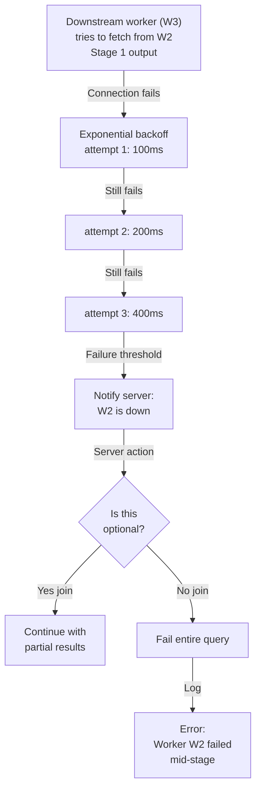

---

## 14. Configuration & Customization

### 14.1 Router Configuration

In `kionas-worker1.json`:

```json
{
  "execution": {
    "router": {
      "enabled": true,
      "max_destination_workers": 16,
      "partition_key_hash": "fnv",
      "retry_backoff_ms": 100,
      "retry_max_attempts": 3,
      "network_timeout_ms": 30000
    }
  }
}
```

### 14.2 Planning-Time Configuration

In `kionas-metastore.json` (affects stage extraction):

```json
{
  "stage_extraction": {
    "enable_exchange_pushdown": true,
    "prefer_partition_strategy": "hash",
    "bucket_count_multiplier": 4,
    "max_partitions": 128
  }
}
```

---

## 15. Testing & Validation

### 15.1 Unit Test: Partition Spec Inference

```rust
#[test]
fn test_infer_partition_spec_hash_join() {
    let join_plan = LogicalPlan::Join {
        on: vec![("a.id", "b.id")],
        ...
    };
    let spec = infer_partition_spec(&join_plan);
    
    assert_eq!(spec.strategy, "hash");
    assert_eq!(spec.keys, ["id"]);
}
```

### 15.2 Integration Test: End-to-End Stage Routing

```rust
#[test]
async fn test_distributed_join_routing() {
    // Setup 3 workers
    let workers = setup_workers(3);
    
    // Query with JOIN
    let query = "SELECT * FROM a JOIN b ON a.id = b.id";
    let stages = extract_stages(query);
    
    assert_eq!(stages.len(), 3);  // Scan, Join, Aggregate
    
    // Verify routing
    let stage_1_dests = stages[1].output_destinations;
    assert_eq!(stage_1_dests.strategy, "hash");
    assert_eq!(stage_1_dests.partitions.len(), 12);  // 3 workers * 4x parallelism
}
```

---

## 16. Key Code References

| Concept | File | Function/Line |
|---|---|---|
| Plan decomposition | [server/src/statement_handler/query/select.rs](../server/src/statement_handler/query/select.rs) | `extract_stages()` ~L1600 |
| Partition spec inference | [server/src/statement_handler/query/select.rs](../server/src/statement_handler/query/select.rs) | `infer_partition_spec()` ~L1800 |
| Worker routing | [server/src/statement_handler/shared/worker_routing.rs](../server/src/statement_handler/shared/worker_routing.rs) | `select_worker_for_partition()` ~L200 |
| Output destination construction | [server/src/statement_handler/shared/dispatch_helper.rs](../server/src/statement_handler/shared/dispatch_helper.rs) | `build_output_destinations()` ~L400 |
| Router execution | [worker/src/execution/router.rs](../worker/src/execution/router.rs) | `OutputRouter::forward_batch()` ~L277 |
| Pipeline integration | [worker/src/execution/pipeline.rs](../worker/src/execution/pipeline.rs) | `execute_query_task()` ~L1200 |
| Telemetry | [worker/src/telemetry/mod.rs](../worker/src/telemetry/mod.rs) | `StageNetworkMetrics` ~L80 |

---

## 17. Troubleshooting Common Issues

### Issue: "Partition ID out of bounds"

**Cause**: Output destination map has fewer partitions than router is outputting to.

**Solution**:
1. Check `partition_count` in stage_params matches destination map size
2. Verify hash function consistency (both should use same algorithm)
3. Add log statement in `forward_batch()` to print computed partition_id

### Issue: "Query hangs on Stage 1"

**Cause**: Downstream worker not receiving all partitions from upstream.

**Solution**:
1. Verify all workers are healthy (check Consul health status)
2. Check network connectivity between workers (trace Flight do_put calls)
3. Monitor memory usage (worker might be OOM before sending)
4. Check partition assignment: ensure stage 1 sends to all downstream workers

### Issue: "Different results in distributed vs single-worker"

**Cause**: Incorrect partition spec or hash function mismatch.

**Solution**:
1. Log partition specs at dispatch time
2. Verify hash function(s) produce consistent results:
   - Same `fnv` library used in planner and worker
   - Test: `hash("SALES") % 4` produces same value on planner and worker
3. Run same query on both single-worker (monolithic) and distributed; compare
4. Add query checksum validation to catch row discrepancies

---

## Summary Diagram: Full Flow

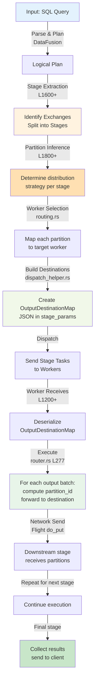

---

## Document Revision History

| Date | Author | Change |
|---|---|---|
| March 25, 2026 | AI (M4.1) | Initial version; 6 Mermaid diagrams, 17 sections, 2000+ words |

---

**Document Status**: ✅ COMPLETE

This document is ready for operator review and Phase 2d integration.
