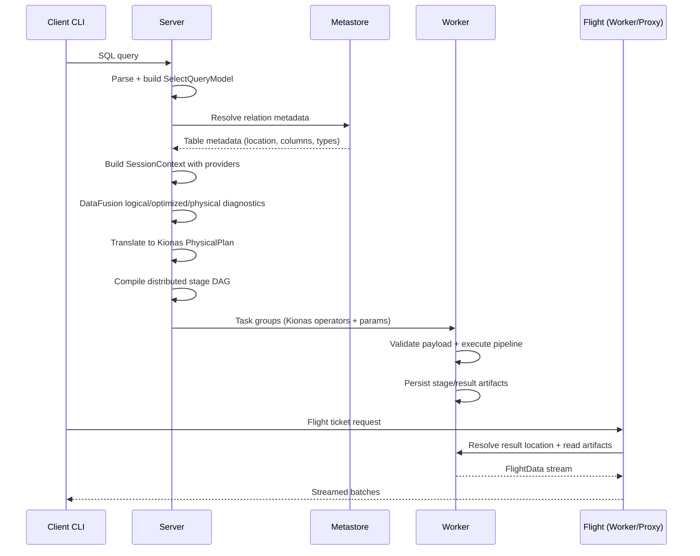
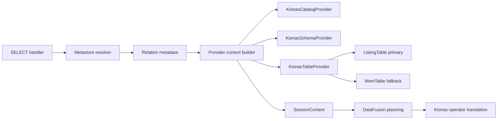

# DataFusion E2E Path Discovery

## Scope
This discovery documents the implemented runtime query path after the DataFusion provider/planning changes.

Primary flow covered:
- Client -> Server -> Worker -> Flight -> Client

Special focus covered:
- DataFusion providers architecture in the server (`CatalogProvider`, `SchemaProvider`, `TableProvider` composition and registration)

Out of scope:
- New feature design
- Protocol redesign
- Code changes

## Why This Matters
The DataFusion change moved planning and provider ownership to the server side while preserving the worker execution contract as Kionas task operators. This document provides a single traceable map from query submission to result streaming.

## High-Level Path
1. Client submits SQL to server.
2. Server parses SQL and builds canonical query model.
3. Server resolves relation metadata via metastore and builds provider-backed DataFusion context.
4. Server generates DataFusion diagnostics and translates execution intent into Kionas physical operators.
5. Server compiles distributed stage task groups and dispatches to worker.
6. Worker validates payload, executes operator pipeline, and materializes artifacts.
7. Flight server/proxy resolves ticket and streams artifacts to client.
8. Client renders rows and reports query summary.

## Sequence Diagram

## Component Diagram (Providers Focus)

## Hop 1: Client -> Server
### Responsibilities
- Submit SQL and receive structured query handle.
- Parse handle and prepare internal ticket for Flight retrieval.

### Key Evidence
- [client/src/main.rs](client/src/main.rs)
- [server/src/services/warehouse_service_server.rs](server/src/services/warehouse_service_server.rs)

### Notes
- Client-side flow remains transport-oriented.
- Planning and provider ownership are server-side.

## Hop 2: Server Planning and Dispatch
### Responsibilities
- Parse statement and route SELECT handling.
- Build canonical query model.
- Resolve relation metadata (columns, location) from metastore.
- Build provider-backed DataFusion context.
- Produce logical/optimized/physical diagnostics.
- Translate to Kionas physical operator plan.
- Compile distributed stage task groups and dispatch.

### Key Evidence
- [server/src/statement_handler/query/select.rs](server/src/statement_handler/query/select.rs)
- [server/src/planner/engine.rs](server/src/planner/engine.rs)
- [server/src/statement_handler/shared/distributed_dag.rs](server/src/statement_handler/shared/distributed_dag.rs)
- [server/src/statement_handler/shared/helpers.rs](server/src/statement_handler/shared/helpers.rs)

### Runtime Contracts Emitted in Task Params
- `database_name`
- `schema_name`
- `table_name`
- `query_kind`
- `query_run_id`
- `scan_mode`
- `scan_delta_version_pin`
- `scan_pruning_hints_json`
- `relation_columns_json`
- RBAC context fields (`__auth_scope`, `__rbac_user`, `__rbac_role`)

## Hop 3: Worker Receive and Execute
### Responsibilities
- Receive task request over worker gRPC.
- Route operation to query runtime.
- Validate payload shape and extract runtime plan.
- Execute local operator pipeline:
  - Scan
  - Filter
  - HashJoin
  - Aggregate Partial/Final
  - Projection
  - Sort
  - Limit
  - Materialize
- Persist stage and result artifacts.

### Key Evidence
- [worker/src/services/worker_service_server.rs](worker/src/services/worker_service_server.rs)
- [worker/src/transactions/maestro.rs](worker/src/transactions/maestro.rs)
- [worker/src/execution/query.rs](worker/src/execution/query.rs)
- [worker/src/execution/planner.rs](worker/src/execution/planner.rs)
- [worker/src/execution/pipeline.rs](worker/src/execution/pipeline.rs)
- [worker/src/execution/artifacts.rs](worker/src/execution/artifacts.rs)

### Important Runtime Behavior
- Empty table scan path is treated as valid empty result behavior, not dispatch failure.
- Worker continues to execute Kionas operator contracts, not DataFusion plans.

## Hop 4: Worker/Proxy Flight -> Client
### Responsibilities
- Decode ticket.
- Resolve task result location.
- Read staged parquet artifacts.
- Stream Arrow Flight batches back to client.

### Key Evidence
- [worker/src/flight/server.rs](worker/src/flight/server.rs)
- [flight_proxy/src/main.rs](flight_proxy/src/main.rs)
- [client/src/main.rs](client/src/main.rs)

## DataFusion Providers (Dedicated Section)
## Overview
The providers layer centralizes DataFusion catalog/schema/table registration from metastore metadata and is server-owned.

### Module Topology
- [server/src/providers/mod.rs](server/src/providers/mod.rs)
- [server/src/providers/context_builder.rs](server/src/providers/context_builder.rs)
- [server/src/providers/table_provider.rs](server/src/providers/table_provider.rs)
- [server/src/providers/metastore_resolver.rs](server/src/providers/metastore_resolver.rs)
- [server/src/providers/relation_metadata.rs](server/src/providers/relation_metadata.rs)
- [server/src/providers/type_mapping.rs](server/src/providers/type_mapping.rs)
- [server/src/providers/identifier.rs](server/src/providers/identifier.rs)

### Responsibilities by Component
1. Metastore resolution
- `KionasMetastoreResolver` fetches table metadata through pooled deadpool clients.
- Normalizes database/schema/table identifiers.

2. Canonical relation metadata
- `KionasRelationMetadata` and `KionasColumnMetadata` normalize names and carry location/column contracts.

3. Table provider selection
- Primary: `ListingTable` for real scans.
- Fallback: `MemTable` for degraded/test scenarios.

4. Catalog/schema/table registration
- `build_session_context_with_kionas_providers` deterministically registers catalog, schema, and table providers into DataFusion `SessionContext`.

5. Type mapping policy
- Metastore type strings map to Arrow types for provider schema materialization.

### Integration Points
- Provider-backed planning context is consumed by:
  - [server/src/planner/engine.rs](server/src/planner/engine.rs)
  - [server/src/statement_handler/query/select.rs](server/src/statement_handler/query/select.rs)

### Naming and Boundary
- Kionas-prefixed provider naming is used for clarity in diagnostics and ownership.
- Worker boundary is unchanged: worker receives only Kionas task operators.

## Failure and Fallback Semantics
### Planning-side fallbacks
- Provider/planning flow allows graceful fallback for specific DataFusion failures (for example missing relation/object-store issues) so dispatch can proceed where safe.

### Runtime-side behavior
- Empty source scan does not fail query dispatch; it yields empty query results.
- Unsupported pipeline shapes fail fast with validation-oriented error semantics.

### Evidence
- [server/src/planner/engine.rs](server/src/planner/engine.rs)
- [server/src/statement_handler/query/select.rs](server/src/statement_handler/query/select.rs)
- [worker/src/execution/pipeline.rs](worker/src/execution/pipeline.rs)

## Validation Snapshot
Confirmed during rollout:
- fmt/clippy/check: passed
- e2e: passed
- SELECT dispatch path: server to worker successful
- Flight retrieval: successful streaming to client

Supporting discovery context:
- [roadmaps/discover/e2e_tests_after_phase9.md](roadmaps/discover/e2e_tests_after_phase9.md)
- [roadmaps/ROADMAP_DATAFUSION_PHASE1_MATRIX.md](roadmaps/ROADMAP_DATAFUSION_PHASE1_MATRIX.md)

## Residual Risks and Follow-Up
1. ListingTable fallback to MemTable can mask misconfigured physical data locations if not monitored.
2. Object-store registration hardening can further reduce fallback reliance.
3. Additional stress scenarios for distributed heavy joins/aggregates remain optional hardening work.

## Closure Checklist
- [x] End-to-end path documented (client -> server -> worker -> flight -> client)
- [x] Dedicated DataFusion providers section included
- [x] Sequence and component diagrams included
- [x] Evidence links included for each major stage
- [x] Final document created under roadmaps/discover
