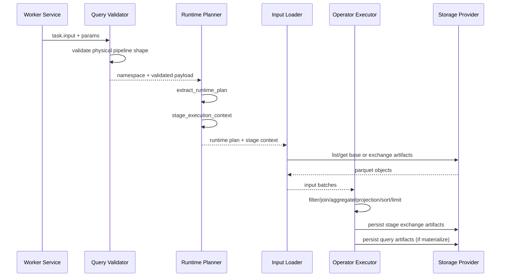
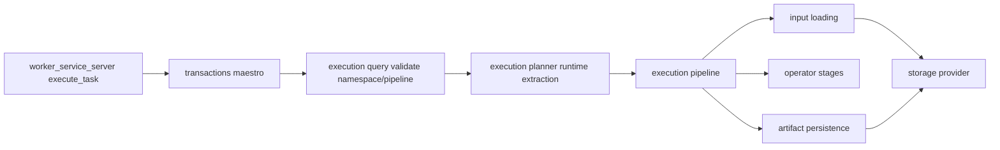

# Execution Pipeline Discovery

## Server-Side Query Orchestration & Task Dispatch Architecture

### 1. Query Planning & Stage DAG Creation

#### 1.1 Query Plan Compilation Flow
**Location**: [server/src/statement_handler/query/select.rs](server/src/statement_handler/query/select.rs#L635)

```
SQL Query
  ↓
AST Parsing
  ↓
DataFusion Logical Plan → Physical Plan
  ↓
Convert Physical Plan to Distributed Physical Plan
  ↓
Validate Distributed Plan
```

**Stage Creation**:
- Physical plans are converted to distributed plans via `distributed_from_physical_plan()`
- Distributed plan contains:
  - `stages`: Vec of executable stages (each with operators and partition spec)
  - `dependencies`: Vec of stage dependencies (from_stage_id → to_stage_id relationships)

#### 1.2 DAG Compilation: Physical → Task Groups
**Location**: [server/src/statement_handler/shared/distributed_dag.rs](server/src/statement_handler/shared/distributed_dag.rs#L69)

Function `compile_stage_task_groups()` transforms:
- **Input**: DistributedPhysicalPlan with stages and dependencies
- **Process**:
  1. Build upstream dependency map for each stage
  2. Calculate partition fan-out count per stage (default 4, configurable via `KIONAS_STAGE_PARTITION_FANOUT`)
  3. For each stage, expand into task groups (one per partition)
  4. Encode dependencies as JSON in task params for backward compatibility

- **Output**: Vec<StageTaskGroup> containing:
  - `stage_id`: Stage identifier
  - `upstream_stage_ids`: Dependencies that must complete first
  - `partition_index` & `partition_count`: Partition assignment
  - `operation`: "query" string
  - `payload`: Serialized stage.operators
  - `params`: HashMap with stage metadata (stage_id, upstream_ids, partition details, database/schema/table, query_run_id, scan mode, etc.)

**Key Decision Point #1**: Partition fan-out is decided at compile time and embedded in task groups. This determines parallelism granularity.

---

### 2. Task Scheduling & Dispatch

#### 2.1 Server-Side Scheduler
**Location**: [server/src/statement_handler/shared/helpers.rs:run_stage_groups_for_input()](server/src/statement_handler/shared/helpers.rs#L270)

**Scheduling Algorithm**:
```
1. Initialize: completed = {}, result_by_stage = {}
2. Loop while completed.len() < total_stages:
   a. Find next ready stage:
      - Not yet completed (stage_id not in completed)
      - All upstream dependencies satisfied (all upstream_stage_ids in completed)
      - Use .min() to deterministically select smallest stage_id
   
   b. If no ready stage found: ERROR (cyclic dependency)
   
   c. Retrieve all partition tasks for ready stage
   
   d. Dispatch all partitions in parallel using tokio::task::JoinSet
   
   e. Wait for ALL partitions to complete before marking stage complete
   
   f. Mark stage complete, store result location
```

**Key Decision Point #2**: **Sequential Stage Execution** - The while loop blocks on each stage completing all partitions before proceeding to the next stage.

**Partition-Level Parallelism**: Within a stage, all partitions are dispatched concurrently via JoinSet, but no stage can start until all upstream stages are fully complete.

#### 2.2 Task Creation & Dispatch Flow

**Step 1: Task Creation**
```
Location: server/src/statement_handler/shared/helpers.rs:build_task_and_schedule()
  ↓
TaskManager.create_task() → Task ID
  ↓
Mark task as Scheduled
```

**Step 2: Task Retrieval & Request Conversion**
```
Location: server/src/statement_handler/shared/helpers.rs:run_task_for_input_with_params()
  ↓
Fetch task from TaskManager
  ↓
Convert Task → TaskRequest (via tasks::task_to_request())
  ↓
Mark task as Running
```

**Step 3: Worker Connection & Dispatch**
```
Location: server/src/workers/send_task_to_worker()
  ↓
Acquire pooled worker connection (with heartbeat validation)
  ↓
Send TaskRequest via gRPC execute_task RPC
  ↓
Record result location & task state in TaskManager
```

---

### 3. Stage Dependencies & Exchange Patterns

#### 3.1 Dependency Encoding
**Location**: [server/src/statement_handler/shared/distributed_dag.rs](server/src/statement_handler/shared/distributed_dag.rs#L103)

Task params include:
- `upstream_stage_ids`: JSON array of dependency stage IDs
- `upstream_partition_counts`: JSON map of stage_id → partition_count
- `partition_spec`: Partitioning strategy (Single|Broadcast|Hash{...})

**Examples**:
- **Single-stage query**: No dependencies, upstream_stage_ids = []
- **Join query**: Stage 1 (scan left), Stage 2 (scan right), Stage 3 (join) depends on [1,2]
- **Aggregate + join**: Multiple stages with linear or tree-structured dependencies

#### 3.2 Exchange Mechanism
**Location**: [worker/src/execution/pipeline.rs](worker/src/execution/pipeline.rs#L1400)

When a stage has upstream dependencies:
1. Worker reads exchange data from upstream stages via S3 prefix
2. Data location pattern: `s3://<warehouse>/<session_id>/<query_run_id>/stage_<id>/partition_<idx>/`
3. Worker loads parquet files from exchange location
4. Processes operators in pipeline
5. Writes results back to exchange location for downstream stages

**Exchange Points**:
- Deterministic S3 paths enable inter-stage data flow
- Each stage reads upstream partition data sequentially (no parallel upstream reads)
- Each partition writes to its designated exchange location

---

### 4. Current Execution Patterns & Constraints

#### 4.1 Sequential Stage Execution
**Current Architecture**: **Strictly Sequential per Stage**

```
Timeline:
Stage 0 (4 partitions) ════════════════════════════════════════ COMPLETE
                               ↓ All partitions done
                        Stage 1 (4 partitions) ════════════════ COMPLETE
                                               ↓ All partitions done  
                                        Stage 2 (1 partition) ══ COMPLETE
```

**Why Sequential?**:
- Server scheduler uses a while loop that blocks until all partitions of current stage complete
- No stage can begin execution while any predecessor stage has running tasks
- Dependency graph is strictly validated: `deps.iter().all(|upstream| completed.contains(upstream))`

#### 4.2 Within-Stage Parallelism
**Current**: Partitions within a stage execute in parallel on multiple workers

**Limitations**:
- All partitions must complete before stage is marked done
- No partial stage advancement
- Timeout applies per entire stage, not per partition
- Worker selection is round-robin from worker pool

#### 4.3 Critical Bottlenecks

1. **Server-Level Blocking Scheduler**
   - `run_stage_groups_for_input()` contains synchronous while loop
   - No pipelining between stages
   - Total query time = Sum(stage_time) + overhead
   
2. **All-or-Nothing Stage Completion**
   - Single partition failure fails entire stage
   - Must wait for slowest partition in stage
   - Worker straggler problem not addressed

3. **Exchange Data Path**
   - No streaming: must write full partition → read full partition
   - S3 round trips for each stage boundary
   - Sequential read of upstream partitions from exchange location

4. **Partition Granularity Fixed at Compile Time**
   - Fan-out count decided before execution
   - Cannot adjust based on runtime statistics
   - 4 partitions default regardless of data volume

#### 4.4 Single-Stage vs Multi-Stage Patterns

| Pattern | Description | Parallelism | Bottleneck |
|---------|-------------|-------------|-----------|
| **Full Scan** | Stage 0 only (scan, filter, project) | Partition-level | Worker throughput |
| **Single Join** | Stage 0, 1 (parallel scans), Stage 2 (join) | Partition-level within stage | Join performance, partition 0 result dependency |
| **Multi-Join/Aggregate** | 3+ stages linear | Partition-level within stage | Cumulative stage latency |
| **Broadcast Join** | Special stage with PartitionSpec::Broadcast | Single partition (1 task) | Large broadcast data transfer |

---

### 5. Key Architectural Patterns

#### 5.1 Task Model
```rust
Task {
    id: String,
    query_id: String,
    session_id: String,
    operation: "query",
    payload: String,  // Serialized physical operators
    params: HashMap<String, String>,  // Stage metadata
    state: TaskState {Pending, Scheduled, Running, Succeeded, Failed},
    attempts: u32,
    max_retries: u32,
    result_location: Option<String>,  // S3 path to results
    error: Option<String>,
}
```

#### 5.2 Execution Context Propagation
**At Server**:
- Compile stages → task groups
- Encode dependencies in params
- Dispatch with auth context + timeout

**At Worker**:
- Receive task with params
- Extract stage_execution_context() from params:
  - stage_id, upstream_stage_ids, upstream_partition_counts
  - partition_index, partition_count
  - query_run_id, scan_mode, delta_version_pin
- Execute pipeline with upstream data awareness

#### 5.3 Determinism & Idempotency
- Stage IDs are stable across query plan transformations
- Partition indices are deterministic (0..partition_count)
- Result locations are deterministic: `stage_<id>/partition_<idx>/`
- Query run ID allows multiple runs to use same stage structure

---

### 6. Execution Flow: End-to-End

#### 6.1 SELECT Query Flow
```
1. handle_select_query() [select.rs]
   ↓
2. Parse AST → Logical Plan → Physical Plan
   ↓
3. Validate distributed plan
   ↓
4. compile_stage_task_groups()
   ↓
5. run_stage_groups_for_input() [Server Scheduler]
   │
   ├─ While loop: for each ready stage
   │  │
   │  ├─ Identify dependencies as complete
   │  │
   │  ├─ For stage_id, spawn JoinSet with partition tasks:
   │  │  │
   │  │  ├─ For each partition_index in 0..partition_count:
   │  │  │  │
   │  │  │  ├─ run_task_for_input_with_params()
   │  │  │  │  ├─ build_task_and_schedule()
   │  │  │  │  ├─ acquire_pooled_conn()
   │  │  │  │  ├─ dispatch_task_and_record()
   │  │  │  │  └─ Return result_location
   │  │  │
   │  │  └─ Join all partition tasks
   │  │
   │  ├─ Collect partition results
   │  │
   │  └─ Record stage_id complete
   │
   └─ Return final stage result location

6. Worker receives task via gRPC execute_task RPC
   ↓
7. extract_runtime_plan() + stage_execution_context()
   ↓
8. Load input batches (from upstream stage or scan)
   ↓
9. Execute operator pipeline:
   - Filter → Join → Aggregate → Project → Sort → Limit
   ↓
10. persist_stage_exchange_artifacts()
    ↓
11. Write parquet + commit, return result_location
    ↓
12. Server receives TaskResponse with result_location
    ↓
13. Final result location delivered to client
```

---

### 7. Areas Preventing Real Parallelism

#### 7.1 Server-Level Constraints

1. **Sequential While Loop** (line 410-430 in helpers.rs)
   - Must complete stage iteration before checking next stage
   - No spawning of independent stage futures
   - Blocks on `completed.len() < groups_by_stage.len()`

2. **Stage Granularity**
   - Stages are atomic units: all-or-nothing completion
   - No partial advancement of independent sub-DAGs
   - No speculative execution or eager pipelining

3. **Dependency Enforcement**
   - Hard wait on `deps.iter().all(|upstream| completed.contains(upstream))`
   - No out-of-order execution or wavefront advancement

#### 7.2 Worker-Level Constraints

1. **Exchange Data Blocking**
   - Worker must wait for all upstream partitions to complete (via exchange location listing)
   - No partial exchange consumption
   - Sequential read of partition files

2. **No Pipeline Between Stages**
   - Worker processes entire input stage → outputs completely
   - Then next stage begins fresh read from S3

#### 7.3 Exchange Pattern Limitations

1. **Deterministic Paths**
   - Must know stage_id, partition_index at compile time
   - Cannot dynamically route based on runtime data distribution

2. **All Data Must Be Written**
   - Full materialization required before downstream stage starts
   - No streaming or push-based consumption

---

### 8. Architectural Decisions Required for True Parallelism

#### 8.1 At Planning Stage
- [ ] **Decision**: Support independent stage DAG execution versus merged DAG
- [ ] **Decision**: Partition fan-out strategy (adaptive vs compile-time)
- [ ] **Decision**: Exchange topology (push vs pull vs work-stealing)

#### 8.2 At Scheduling Stage
- [ ] **Decision**: Async task spawning for independent stages (not sequential while loop)
- [ ] **Decision**: Ready queue with true topological sort (not min() deterministic pick)
- [ ] **Decision**: Pipelined stage execution (allow downstream to start before upstream completes)
- [ ] **Decision**: Resource-aware scheduling (worker affinity, backpressure handling)

#### 8.3 At Execution Stage
- [ ] **Decision**: Streaming exchange (micro-batches) vs full materialization
- [ ] **Decision**: Work-stealing from sibling partitions
- [ ] **Decision**: Adaptive partition count based on executor availability
- [ ] **Decision**: Out-of-order partition execution

#### 8.4 At Observability Stage
- [ ] **Decision**: Per-partition metrics vs per-stage aggregates
- [ ] **Decision**: Critical path tracing
- [ ] **Decision**: Stragggler detection and corrective action

---

### 9. Summary: Current Architecture Characteristics

| Aspect | Current State |
|--------|---------------|
| **Overall Pattern** | Strictly Sequential Multi-Stage DAG Execution |
| **Stage Parallelism** | None (sequential while loop) |
| **Partition Parallelism** | Full (JoinSet across all partitions within stage) |
| **Dependency Model** | Hard blocking on complete upstream stages |
| **Exchange Pattern** | Full materialization to S3 with sequential reads |
| **Scheduling Complexity** | O(stages) with O(1) per stage identification |
| **Bottleneck** | Server scheduler while loop + slowest partition in stage |
| **Critical Path** | Sum of all stage execution times |
| **Stragglers** | Entire stage must wait for slowest partition |
| **Resource Utilization** | Worker pool idle between stage boundaries |

---

### 10. Key Files & Locations Reference

| Responsibility | File | Key Functions |
|----------------|------|----------------|
| Query Planning | [server/src/statement_handler/query/select.rs](server/src/statement_handler/query/select.rs#L635) | `handle_select_query()` |
| DAG Compilation | [server/src/statement_handler/shared/distributed_dag.rs](server/src/statement_handler/shared/distributed_dag.rs#L69) | `compile_stage_task_groups()` |
| Stage Scheduling | [server/src/statement_handler/shared/helpers.rs](server/src/statement_handler/shared/helpers.rs#L270) | `run_stage_groups_for_input()` |
| Task Dispatch | [server/src/statement_handler/shared/helpers.rs](server/src/statement_handler/shared/helpers.rs#L270) | `run_task_for_input_with_params()`, `dispatch_task_and_record()` |
| Worker Execution | [worker/src/execution/pipeline.rs](worker/src/execution/pipeline.rs#L1400) | `execute_query_task()` |
| Stage Context | [worker/src/execution/planner.rs](worker/src/execution/planner.rs#L617) | `stage_execution_context()`, `extract_runtime_plan()` |
| Task Model | [server/src/tasks/mod.rs](server/src/tasks/mod.rs#L1) | `Task`, `TaskManager`, `TaskState` |

## Scope
This discovery narrows the architecture view to the worker execution pipeline only.

In scope:
- Query task intake and runtime validation
- Stage context and scan hints parsing
- Input loading (base scan and exchange)
- Operator execution order and semantics
- Artifact persistence and Flight-readability implications
- Improvement opportunities for performance, reliability, and observability

Out of scope:
- Server-side SQL parsing and provider construction details
- New protocol design
- Code changes in this phase

## Why This Matters
The execution pipeline is now the runtime backbone for query correctness and distributed behavior. We have a stable operator contract and successful e2e runs, but there are clear opportunities to improve throughput, memory behavior, and debuggability.

## High-Level Runtime Path
1. Worker receives query task and routes to query execution entry.
2. Runtime validates payload shape and extracts executable operator plan.
3. Stage context is derived from task params.
4. Input batches are loaded from base table scan or upstream exchange artifacts.
5. Pipeline applies operators in deterministic order.
6. Stage exchange artifacts are persisted.
7. Materialization writes task-scoped query artifacts for Flight retrieval.

## Sequence Diagram


## Component Diagram


## Current Implementation: What We Have

## Entry and Validation
Responsibilities:
- Route query operation safely.
- Validate query payload invariants.
- Enforce linear operator pipeline shape before execution.

Evidence:
- [worker/src/services/worker_service_server.rs](worker/src/services/worker_service_server.rs)
- [worker/src/transactions/maestro.rs](worker/src/transactions/maestro.rs)
- [worker/src/execution/query.rs](worker/src/execution/query.rs)

Notable behavior:
- Payload version and statement constraints are enforced.
- Unsupported pipeline shapes fail fast.
- Stage tasks and non-stage tasks are resolved with distinct namespace paths.

## Runtime Plan and Stage Context Extraction
Responsibilities:
- Decode physical operators from payload.
- Parse filter predicates from transport and/or physical plan.
- Parse stage metadata and scan hints.

Evidence:
- [worker/src/execution/planner.rs](worker/src/execution/planner.rs)

Notable behavior:
- RuntimePlan supports filter, join, aggregate, projection, sort, limit, materialize.
- StageExecutionContext carries stage_id, partition metadata, query_run_id, upstream graph info.
- Runtime scan hints support full and metadata_pruned modes with eligibility metadata.

## Input Loading and Partitioning
Responsibilities:
- Load base table scan input from staging prefix.
- Load upstream exchange artifacts for downstream stages.
- Enforce partition coverage and deterministic partition slicing.

Evidence:
- [worker/src/execution/pipeline.rs](worker/src/execution/pipeline.rs)
- [worker/src/storage/exchange.rs](worker/src/storage/exchange.rs)

Notable behavior:
- Base scan no-file path now degrades to empty input for valid empty-table behavior.
- Upstream partition set validation checks missing/duplicate/out-of-range artifacts.
- Partition slicing uses deterministic row-index modulus partitioning.

## Operator Execution Semantics
Responsibilities:
- Execute operator stack in deterministic order.
- Apply relation column mapping for metastore name parity.
- Normalize batches before persistence.

Evidence:
- [worker/src/execution/pipeline.rs](worker/src/execution/pipeline.rs)
- [worker/src/services/query_execution.rs](worker/src/services/query_execution.rs)
- [worker/src/execution/join.rs](worker/src/execution/join.rs)
- [worker/src/execution/aggregate/mod.rs](worker/src/execution/aggregate/mod.rs)

Notable behavior:
- Operator order: scan -> filter -> hash join -> aggregate partial/final -> projection -> sort -> limit -> materialize.
- Join currently supports constrained inner equi hash join.
- Aggregate pipeline supports count/sum/min/max/avg partial and final stages.

## Artifact Persistence
Responsibilities:
- Persist stage exchange outputs for distributed dependencies.
- Persist final result parquet + metadata for Flight retrieval.

Evidence:
- [worker/src/execution/artifacts.rs](worker/src/execution/artifacts.rs)
- [worker/src/flight/server.rs](worker/src/flight/server.rs)

Notable behavior:
- Deterministic key layout for exchange and query artifact paths.
- Result metadata sidecar includes row/column/artifact details.

## Strengths in Current Pipeline
1. Strong pre-execution validation prevents undefined runtime behavior.
2. Deterministic stage and artifact conventions simplify distributed orchestration.
3. Empty-table behavior is now resilient and user-correct.
4. Clear separation between runtime extraction and execution phases.
5. Existing unit coverage around filter/projection/limit/runtime extraction and pruning behavior.

## Gaps and Risks
1. Materialization currently depends on in-memory batch processing; large datasets can increase memory pressure.
2. Metadata-pruned scan mode is signaling-ready but still falls back to full scan in several paths.
3. Join implementation is intentionally narrow; broader join semantics are not yet supported.
4. Type mapping and runtime typing boundaries can still produce conservative behavior in edge cases.
5. Error taxonomy is mostly string-oriented and could be normalized for stronger diagnostics/reporting.

## Improvement Opportunities

### Priority A: Throughput and Memory
1. Introduce streaming/batched execution between operator stages to reduce peak memory.
2. Add configurable batch-size controls per stage.
3. Add memory metrics per stage (rows in/out, bytes in/out, spill indicators).

### Priority B: Scan and I/O Efficiency
1. Complete metadata-pruned scan implementation so eligible scans avoid full file listing/reads.
2. Add stronger pruning cache observability and invalidation controls.
3. Add explicit differentiation in metrics between full scan fallback and true pruning.

### Priority C: Distributed Reliability
1. Add richer stage-level retry policies for transient object-store errors.
2. Add exchange artifact integrity checks at read time (checksum/row count reconciliation).
3. Add clearer remediation hints for partition coverage errors.

### Priority D: Operator Coverage and Correctness
1. Expand join support envelope beyond constrained inner equi hash joins.
2. Add more aggregate edge-case coverage (null-heavy, mixed types, wide groups).
3. Tighten schema metadata propagation guarantees for strict type-coercion paths.

### Priority E: Observability and UX
1. Introduce structured error codes for runtime failures (validation, io, exchange, execution).
2. Attach stage_id/query_run_id consistently to all runtime error surfaces.
3. Add pipeline explain snapshot export per stage for postmortem debugging.

## Suggested Improvement Roadmap (Documentation-Level)
1. Phase EP-1: Observability and error taxonomy hardening.
2. Phase EP-2: Scan pruning completion and scan-mode truthfulness.
3. Phase EP-3: Memory and throughput optimization of operator execution.
4. Phase EP-4: Expanded join/aggregate runtime envelope.
5. Phase EP-5: Distributed resilience and artifact integrity validation.

## Validation Snapshot
What is stable now:
- Query execution pipeline runs e2e with successful dispatch and Flight retrieval.
- Empty-table behavior no longer fails dispatch path.
- Quality gates were reported as passing in the current cycle.

Related context:
- [roadmaps/discover/datafusion_e2e_path_discovery.md](roadmaps/discover/datafusion_e2e_path_discovery.md)
- [roadmaps/ROADMAP_DATAFUSION_PHASE1_MATRIX.md](roadmaps/ROADMAP_DATAFUSION_PHASE1_MATRIX.md)

## Closure Checklist
- [x] Pipeline-only scope documented
- [x] Current implementation map captured
- [x] Sequence and component diagrams included
- [x] Improvement opportunities prioritized
- [x] Discovery file created under roadmaps/discover
