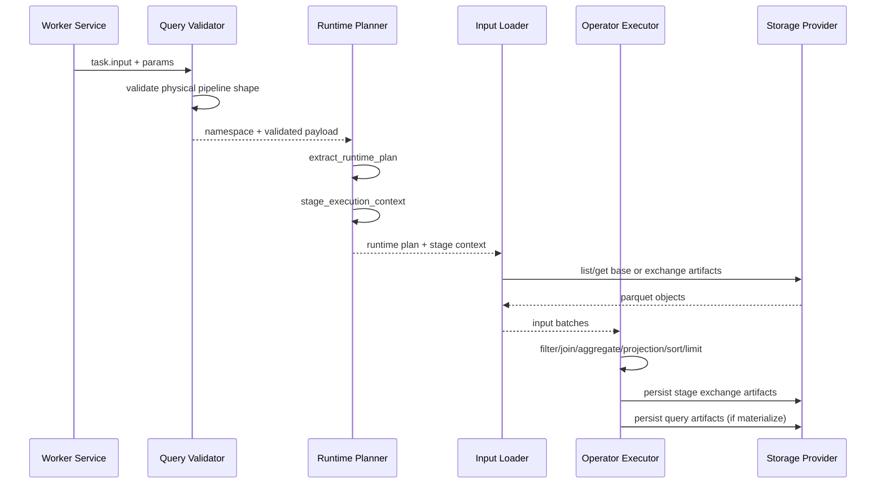
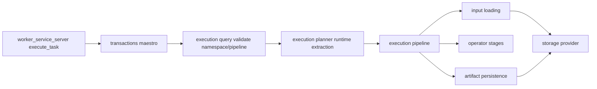

# Execution Pipeline Discovery

## Scope
This discovery narrows the architecture view to the worker execution pipeline only.

In scope:
- Query task intake and runtime validation
- Stage context and scan hints parsing
- Input loading (base scan and exchange)
- Operator execution order and semantics
- Artifact persistence and Flight-readability implications
- Improvement opportunities for performance, reliability, and observability

Out of scope:
- Server-side SQL parsing and provider construction details
- New protocol design
- Code changes in this phase

## Why This Matters
The execution pipeline is now the runtime backbone for query correctness and distributed behavior. We have a stable operator contract and successful e2e runs, but there are clear opportunities to improve throughput, memory behavior, and debuggability.

## High-Level Runtime Path
1. Worker receives query task and routes to query execution entry.
2. Runtime validates payload shape and extracts executable operator plan.
3. Stage context is derived from task params.
4. Input batches are loaded from base table scan or upstream exchange artifacts.
5. Pipeline applies operators in deterministic order.
6. Stage exchange artifacts are persisted.
7. Materialization writes task-scoped query artifacts for Flight retrieval.

## Sequence Diagram

## Component Diagram

## Current Implementation: What We Have

## Entry and Validation
Responsibilities:
- Route query operation safely.
- Validate query payload invariants.
- Enforce linear operator pipeline shape before execution.

Evidence:
- [worker/src/services/worker_service_server.rs](worker/src/services/worker_service_server.rs)
- [worker/src/transactions/maestro.rs](worker/src/transactions/maestro.rs)
- [worker/src/execution/query.rs](worker/src/execution/query.rs)

Notable behavior:
- Payload version and statement constraints are enforced.
- Unsupported pipeline shapes fail fast.
- Stage tasks and non-stage tasks are resolved with distinct namespace paths.

## Runtime Plan and Stage Context Extraction
Responsibilities:
- Decode physical operators from payload.
- Parse filter predicates from transport and/or physical plan.
- Parse stage metadata and scan hints.

Evidence:
- [worker/src/execution/planner.rs](worker/src/execution/planner.rs)

Notable behavior:
- RuntimePlan supports filter, join, aggregate, projection, sort, limit, materialize.
- StageExecutionContext carries stage_id, partition metadata, query_run_id, upstream graph info.
- Runtime scan hints support full and metadata_pruned modes with eligibility metadata.

## Input Loading and Partitioning
Responsibilities:
- Load base table scan input from staging prefix.
- Load upstream exchange artifacts for downstream stages.
- Enforce partition coverage and deterministic partition slicing.

Evidence:
- [worker/src/execution/pipeline.rs](worker/src/execution/pipeline.rs)
- [worker/src/storage/exchange.rs](worker/src/storage/exchange.rs)

Notable behavior:
- Base scan no-file path now degrades to empty input for valid empty-table behavior.
- Upstream partition set validation checks missing/duplicate/out-of-range artifacts.
- Partition slicing uses deterministic row-index modulus partitioning.

## Operator Execution Semantics
Responsibilities:
- Execute operator stack in deterministic order.
- Apply relation column mapping for metastore name parity.
- Normalize batches before persistence.

Evidence:
- [worker/src/execution/pipeline.rs](worker/src/execution/pipeline.rs)
- [worker/src/services/query_execution.rs](worker/src/services/query_execution.rs)
- [worker/src/execution/join.rs](worker/src/execution/join.rs)
- [worker/src/execution/aggregate/mod.rs](worker/src/execution/aggregate/mod.rs)

Notable behavior:
- Operator order: scan -> filter -> hash join -> aggregate partial/final -> projection -> sort -> limit -> materialize.
- Join currently supports constrained inner equi hash join.
- Aggregate pipeline supports count/sum/min/max/avg partial and final stages.

## Artifact Persistence
Responsibilities:
- Persist stage exchange outputs for distributed dependencies.
- Persist final result parquet + metadata for Flight retrieval.

Evidence:
- [worker/src/execution/artifacts.rs](worker/src/execution/artifacts.rs)
- [worker/src/flight/server.rs](worker/src/flight/server.rs)

Notable behavior:
- Deterministic key layout for exchange and query artifact paths.
- Result metadata sidecar includes row/column/artifact details.

## Strengths in Current Pipeline
1. Strong pre-execution validation prevents undefined runtime behavior.
2. Deterministic stage and artifact conventions simplify distributed orchestration.
3. Empty-table behavior is now resilient and user-correct.
4. Clear separation between runtime extraction and execution phases.
5. Existing unit coverage around filter/projection/limit/runtime extraction and pruning behavior.

## Gaps and Risks
1. Materialization currently depends on in-memory batch processing; large datasets can increase memory pressure.
2. Metadata-pruned scan mode is signaling-ready but still falls back to full scan in several paths.
3. Join implementation is intentionally narrow; broader join semantics are not yet supported.
4. Type mapping and runtime typing boundaries can still produce conservative behavior in edge cases.
5. Error taxonomy is mostly string-oriented and could be normalized for stronger diagnostics/reporting.

## Improvement Opportunities

### Priority A: Throughput and Memory
1. Introduce streaming/batched execution between operator stages to reduce peak memory.
2. Add configurable batch-size controls per stage.
3. Add memory metrics per stage (rows in/out, bytes in/out, spill indicators).

### Priority B: Scan and I/O Efficiency
1. Complete metadata-pruned scan implementation so eligible scans avoid full file listing/reads.
2. Add stronger pruning cache observability and invalidation controls.
3. Add explicit differentiation in metrics between full scan fallback and true pruning.

### Priority C: Distributed Reliability
1. Add richer stage-level retry policies for transient object-store errors.
2. Add exchange artifact integrity checks at read time (checksum/row count reconciliation).
3. Add clearer remediation hints for partition coverage errors.

### Priority D: Operator Coverage and Correctness
1. Expand join support envelope beyond constrained inner equi hash joins.
2. Add more aggregate edge-case coverage (null-heavy, mixed types, wide groups).
3. Tighten schema metadata propagation guarantees for strict type-coercion paths.

### Priority E: Observability and UX
1. Introduce structured error codes for runtime failures (validation, io, exchange, execution).
2. Attach stage_id/query_run_id consistently to all runtime error surfaces.
3. Add pipeline explain snapshot export per stage for postmortem debugging.

## Suggested Improvement Roadmap (Documentation-Level)
1. Phase EP-1: Observability and error taxonomy hardening.
2. Phase EP-2: Scan pruning completion and scan-mode truthfulness.
3. Phase EP-3: Memory and throughput optimization of operator execution.
4. Phase EP-4: Expanded join/aggregate runtime envelope.
5. Phase EP-5: Distributed resilience and artifact integrity validation.

## Validation Snapshot
What is stable now:
- Query execution pipeline runs e2e with successful dispatch and Flight retrieval.
- Empty-table behavior no longer fails dispatch path.
- Quality gates were reported as passing in the current cycle.

Related context:
- [roadmaps/discover/datafusion_e2e_path_discovery.md](roadmaps/discover/datafusion_e2e_path_discovery.md)
- [roadmaps/ROADMAP_DATAFUSION_PHASE1_MATRIX.md](roadmaps/ROADMAP_DATAFUSION_PHASE1_MATRIX.md)

## Closure Checklist
- [x] Pipeline-only scope documented
- [x] Current implementation map captured
- [x] Sequence and component diagrams included
- [x] Improvement opportunities prioritized
- [x] Discovery file created under roadmaps/discover
